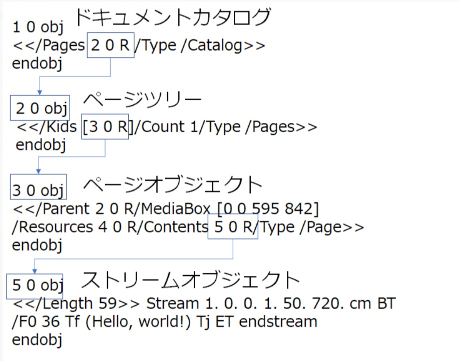
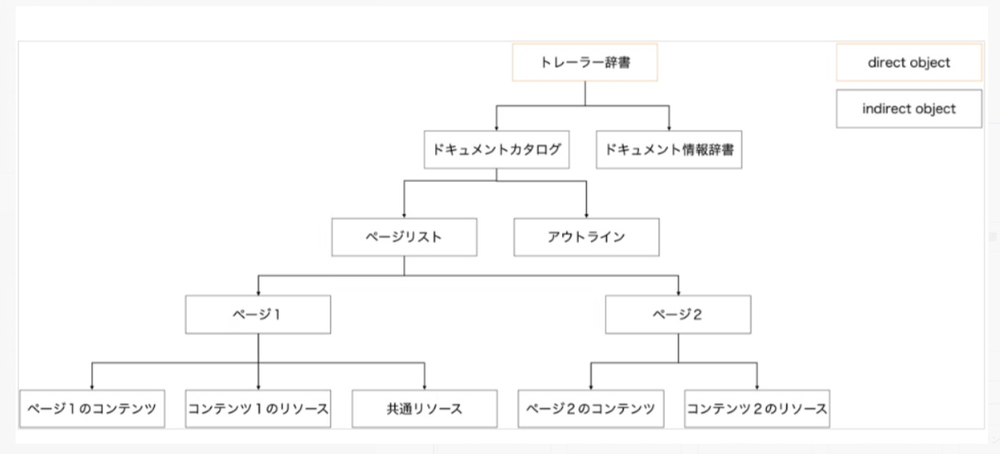

# ページオブジェクトの構造

ページオブジェクトは以下のルールで階層チェーンを形成する

xxx yy obj : オブジェクトのid 
xxx yy R ; オブジェクトを参照することを意味する

- ただし、1 0 obj は　ノート２の　Rootに記述した参照id
- ドキュメントカタログは、すべてのオブジェクトの親。なのでたった１つ
- ページツリーオブジェクトは、ページを束ねるオブジェクト。ページ数を保持する
- ページオブジェクトは、各ページ毎に定義される。どんなパーツ（画像、表、文字列）から構成されているかが記述され、それらへの参照が記述される
- ストリームオブジェクトは、ページ内のパーツの１つ。stream 1.0..0.1.50.720 はレイアウト上の位置情報

この図のほうがわかりやすいか？

