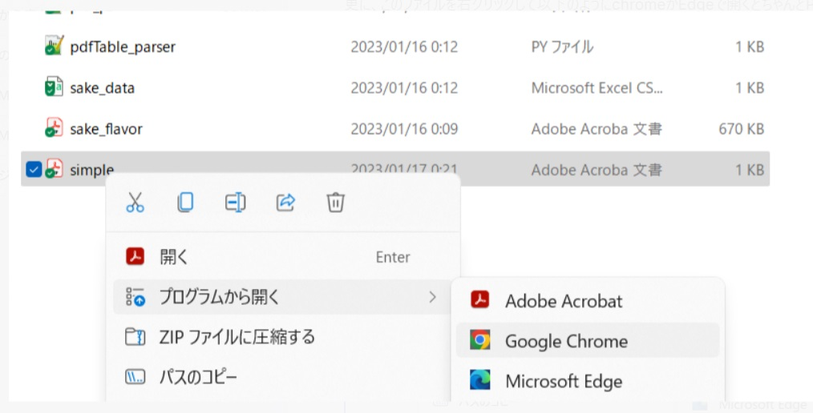
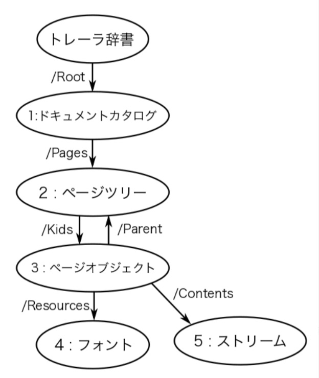

# PDFの構造

参考サイト
https://itchyny.hatenablog.com/entry/2015/09/16/100000

## シンプルなpdfを例に構造を解説する

simple.pdfをvs codeで開くとソースが文字化けせずにすべて表示される。更に、このファイルを右クリックして以下のようにchromeかEdgeで開くとちゃんとPDFが表示される（acrobatだとなぜかエラーになる）

ノート１のsake_flavor をvs codeで開いたソースと上記の階層構造を対比する
構造の階層は、ソースのボトムからスタートすることに注意

### 1. トレーラ辞書
ソースの最終部の　<<  >>で囲われた部分  
ルートの情報記述　

Root 1 0 R　：　1.ドキュメントカタログ（すべてのオブジェクトの親）の参照番号(115 0 R)  参照番号は個々のオブジェクトにつけたIDのようなもの。
xxx yy R  xxx ; オブジェクトid  yy ; バージョン　R ; 参照番号であることを意味する
Size 6 :  相互参照テーブルのサイズ。6 は、0~5 の6個のテーブルからなることを意味する。相互参照テーブルは、PDFの各オブジェクトが本体のどこにあるのか位置（アドレス）を先頭からのバイトで表現したもの。相互参照テーブルは、trailerの上のほうに記述されている（以下に示した）

<<
/Root 1 0 R
/Size 6
>>

### 2. 相互参照テーブル
単語検索などランダムアクセスを実現する重要なしかけ
xref の下の0 6 は5個のテーブル記述があることを意味する（上記のSize 6と一致することに注意）。テーブルの番号体系は　gggggg nnn f/n  ggggg; アドレス（ファイル先頭からのバイト位置）　　nnn; バージョン　　f/n; f 使ってない(free)  n 使っている 

xref
0 6
0000000000 65535 f
0000000015 00000 n
0000000066 00000 n
0000000223 00000 n
0000000125 00000 n
0000000329 00000 n

### 3. ページオブジェクト
ページ毎に個別のオブジェクトで定義される（参照番号がついている）。ページオブジェクトの下階層に文字、画像、URLなど、パーツがまとまり単位にオブジェクトになる。サイズが大きい場合は、たいていストリーム型で圧縮される。

