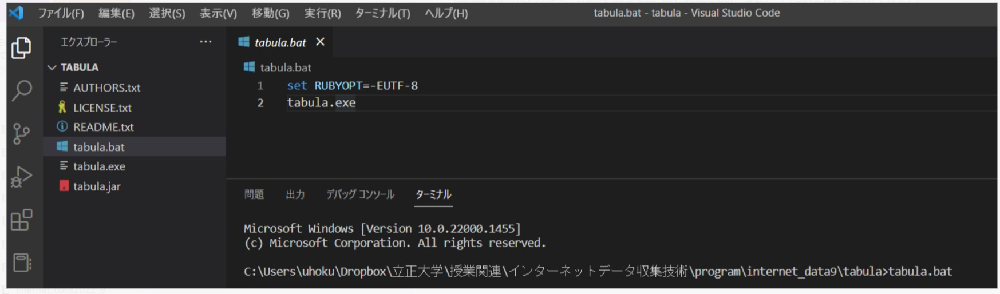
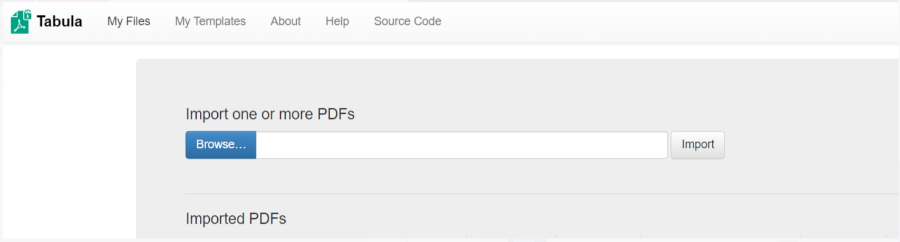

# tabula GUI

まず　ノート１のプログラムで、onion.pdfを読み込んで正しく表をcsvに書き出せるかを
確認せよ。→　うまく抽出できないことがわかる

1. tabula GUIを起動する
2.  vs-codeでtabulaフォルダーに移動する。右下のコマンドラインに　tabula.bat とタイプ入力（pythonのように実行ボタンはないのでタイプして実行する。しばらくすると、ブラウザが起動して、下のような画面になるはず。
3. ここで、tabula.exeでなくて、tabula.batを実行する理由は以下の通り。  
.bat : batchファイル　windowsのコマンドをスクリプトとして一括実行する場合にコマンドを実行する順番にファイルに並べたもの
https://visualizing.jp/tabula-windows-install/

tabula GUIの使い方は以下の通り。japanese_soy_sauce.pdf　の表データをcsvに書き出してみてください。
https://www.bedroomcomputing.com/2020/11/2020-1114-tabula/

